# 🍔 DeliveryBot — Gestión de Pedidos Internos de Cafetería

Automatización construida en **n8n** que convierte a Telegram en una terminal de pedidos para la cafetería de un colegio/empresa: los empleados y estudiantes piden desde un bot, y el personal de cafetería gestiona todo desde otro bot separado, sin salir de Telegram.

---

## 📱 Vista rápida

| Bot de clientes | Bot de administración |
|---|---|
| 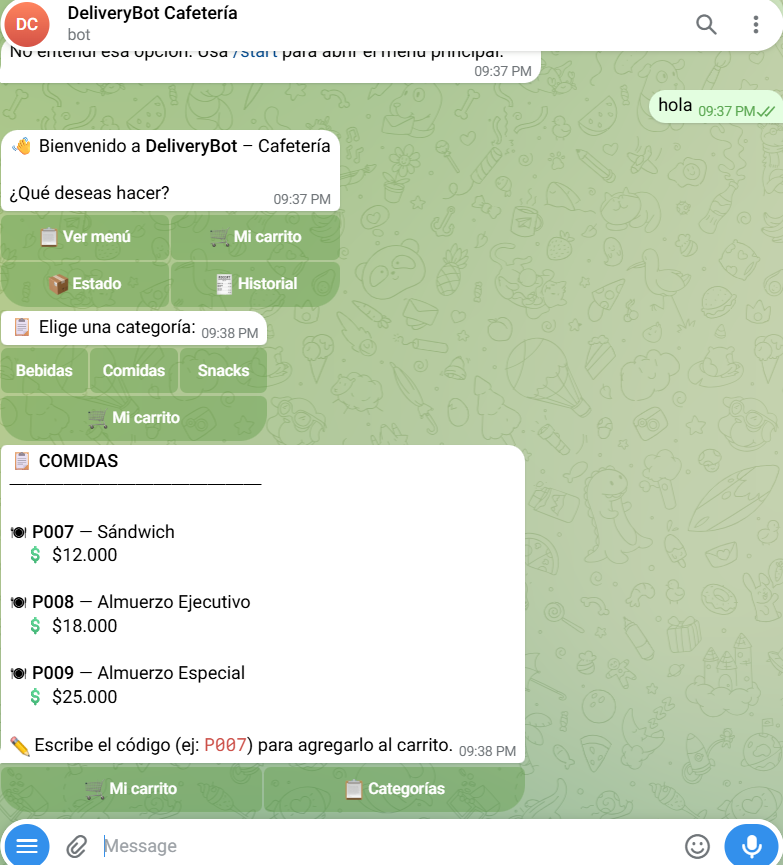 | 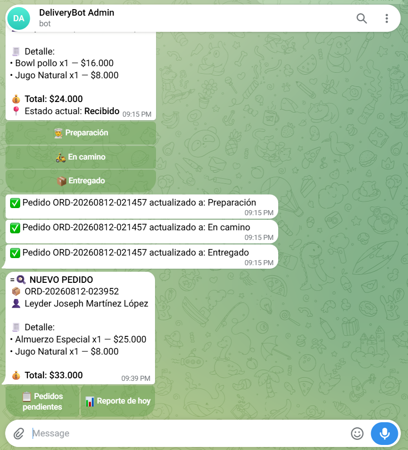 |

---

## 🧭 Arquitectura

Dos bots de Telegram independientes, un mismo backend de automatización y una sola base de datos en Google Sheets:

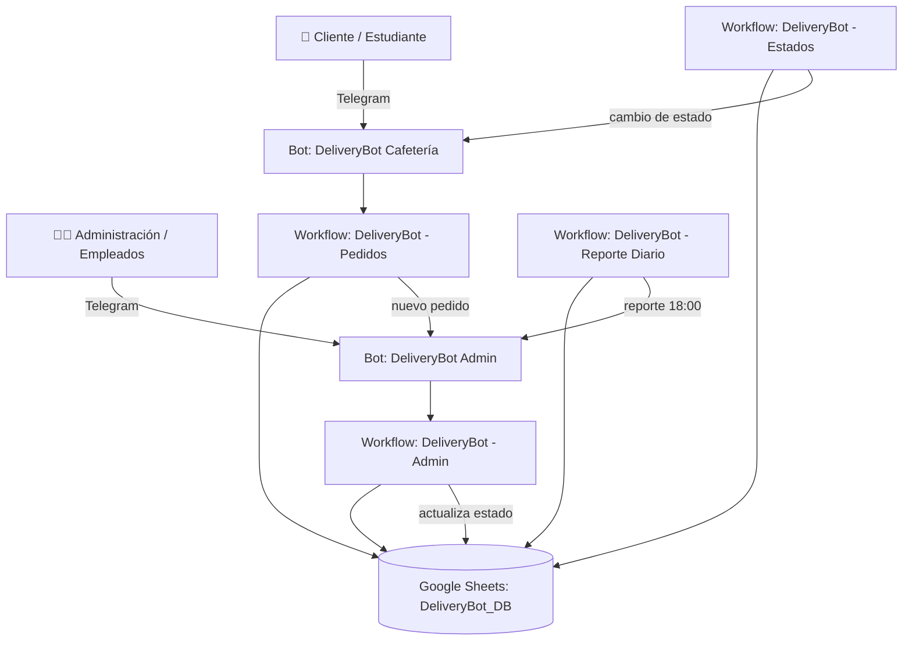

**Cómo se comunican los 4 workflows entre sí:** cuando el admin cambia el estado de un pedido (desde botones), el workflow `Admin` solo actualiza la hoja `PEDIDOS`. El workflow `Estados` sondea esa hoja cada minuto, detecta el cambio y le avisa al cliente — ningún workflow le notifica directamente al cliente, todo pasa por la hoja de cálculo como fuente de verdad.

---

## ✨ Características

- 🛒 **Catálogo por categorías** (Bebidas, Comidas, Snacks) con formato Markdown y precios claros.
- 🧺 **Carrito por usuario**, persistido en Sheets: agregar con el código del producto (`P001`), quitar una unidad con `-P001`.
- ✅ **Validación de stock** antes de confirmar, con instrucciones específicas de qué corregir si algo falta.
- 🔢 **ID de pedido único** con formato `ORD-YYYYMMDD-HHMMSS`.
- 📉 **Descuento automático de stock** al confirmar.
- 🔔 **Notificaciones de estado en tiempo real** al cliente (Recibido → Preparación → En camino → Entregado).
- 🔎 **Botón "Ver estado"** directo desde la confirmación del pedido.
- 👥 **Panel de administración multiempleado**: cualquier persona autorizada en la hoja `ADMINS` puede gestionar pedidos desde el mismo bot.
- 📋 **Lista de pedidos pendientes** y cambio de estado con botones, sin tocar Google Sheets a mano.
- 📊 **Reporte diario automático** (18:00) y **bajo demanda**: total vendido, número de pedidos, producto estrella, hora pico.
- 🔐 **Acceso a administración por lista blanca** — nadie se autorregistra como staff.

---

## 🏗️ Stack técnico

- **n8n Cloud** (plan de prueba) — orquestador de los 4 workflows.
- **Telegram Bot API** — dos bots independientes (`@deliverybot_cafet_bot` para clientes, bot dedicado para administración).
- **Google Sheets** — única fuente de persistencia (sin base de datos externa), vía OAuth2.
- **JavaScript** (nodos Code de n8n) — lógica de carrito, validación de stock, cálculo de reportes.

---


## 🗂️ Estructura de datos — [`DeliveryBot_DB`](https://docs.google.com/spreadsheets/d/18NWIaWc-EiEfVqBDF6Ju0Qy_Q5LCzHaR_beGbuoYpaU/edit?usp=sharing)

| Hoja | Columnas | Propósito |
|---|---|---|
| `MENU` | `id_producto, nombre, descripcion, precio, categoria, stock` | Catálogo de productos |
| `PEDIDOS` | `id_pedido, id_usuario, nombre_usuario, detalles_pedido, total_pago, estado, fecha, hora` | Historial de pedidos y su estado actual |
| `USUARIOS` | `telegram_id, nombre_completo, departamento_oficina, puntos_lealtad` | Clientes registrados |
| `SESSIONS` | `telegram_id, pantalla_actual, carrito_temporal, ultimo_cambio` | Carrito activo por usuario (JSON) |
| `ADMINS` | `telegram_id, nombre, activo` | Lista blanca de personal autorizado en el bot de administración |

Así se ve la hoja `MENU` en producción:

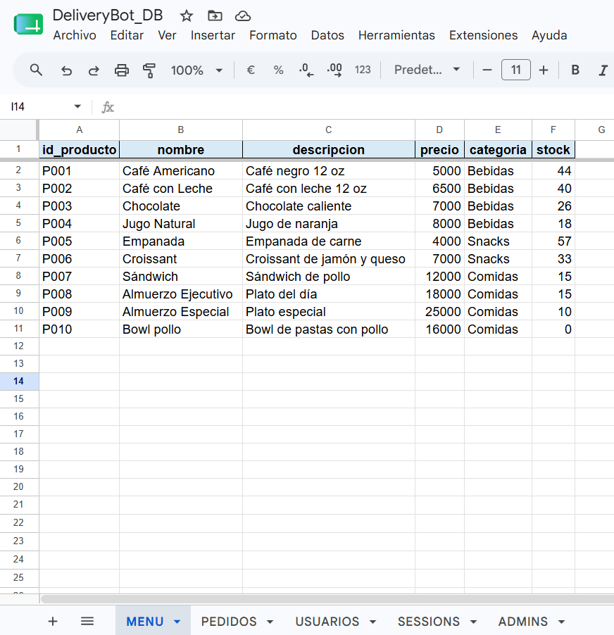

---

## ⚙️ Workflows de n8n

| Workflow | Disparador | Función |
|---|---|---|
| **DeliveryBot - Pedidos** | Telegram Trigger (bot clientes) | Menú, carrito, confirmación de pedido, descuento de stock, notificación a cocina |
| **DeliveryBot - Estados** | Google Sheets Trigger (sondeo cada minuto sobre `PEDIDOS`) | Avisa al cliente cuando cambia el estado de su pedido |
| **DeliveryBot - Reporte Diario** | Cron (18:00 diario) | Calcula y envía el reporte de ventas del día a todo el personal activo |
| **DeliveryBot - Admin** | Telegram Trigger (bot administración) | Panel de control: pedidos pendientes, detalle de pedido, cambio de estado, reporte bajo demanda |

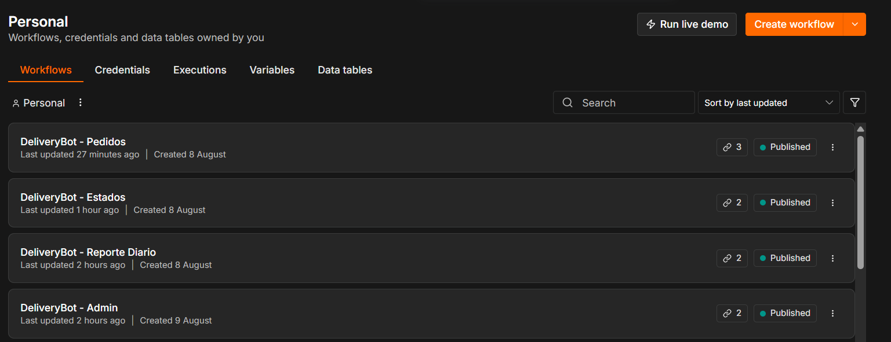

---

## 📸 Recorrido del sistema

### 1. El cliente explora el menú y arma su carrito
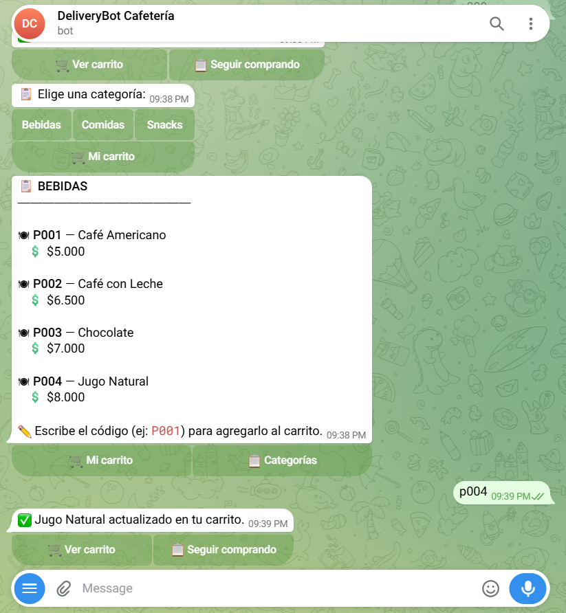

### 2. Confirma el pedido y puede consultar el estado desde el mismo mensaje
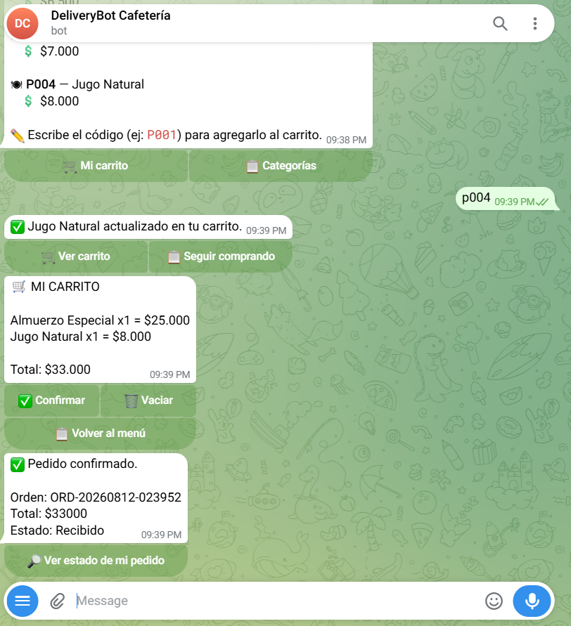

### 3. El bot de administración recibe el pedido con botones de acción inmediatos
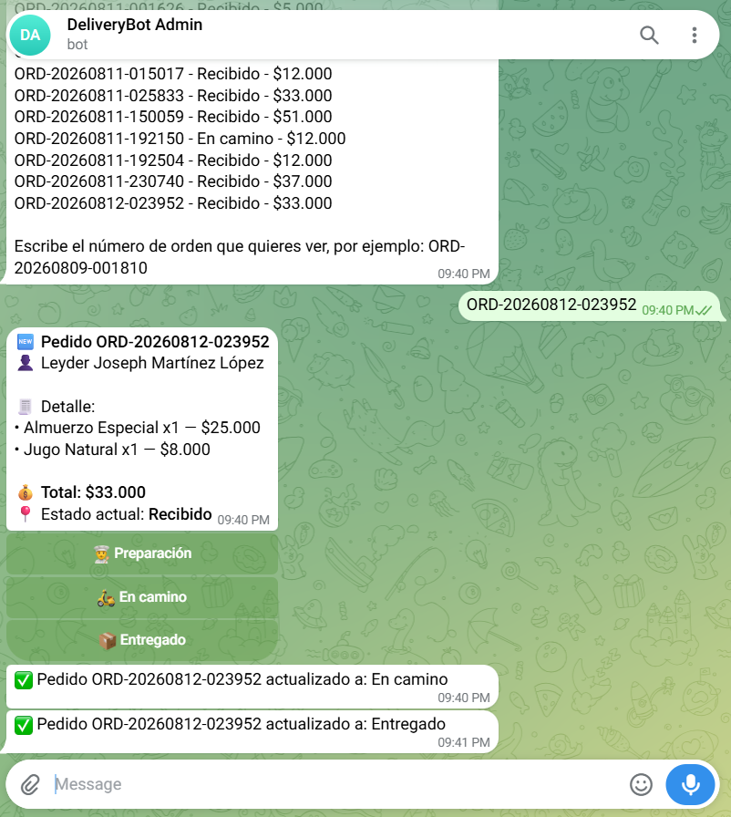

### 4. El administrador consulta pendientes y actualiza el estado con un toque
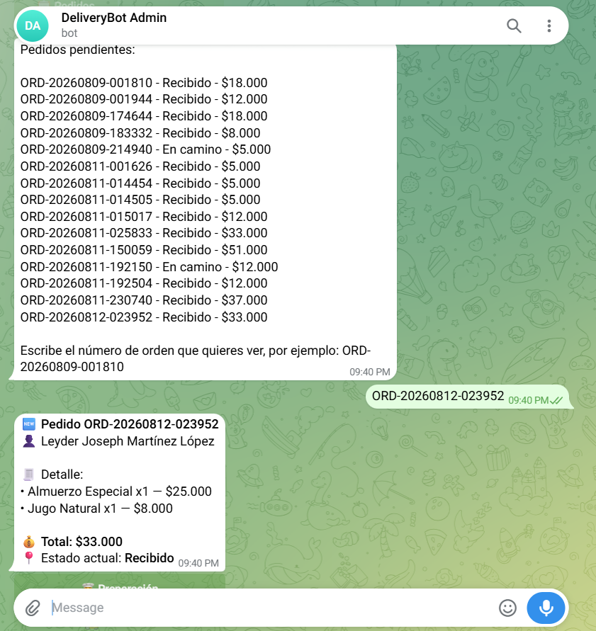
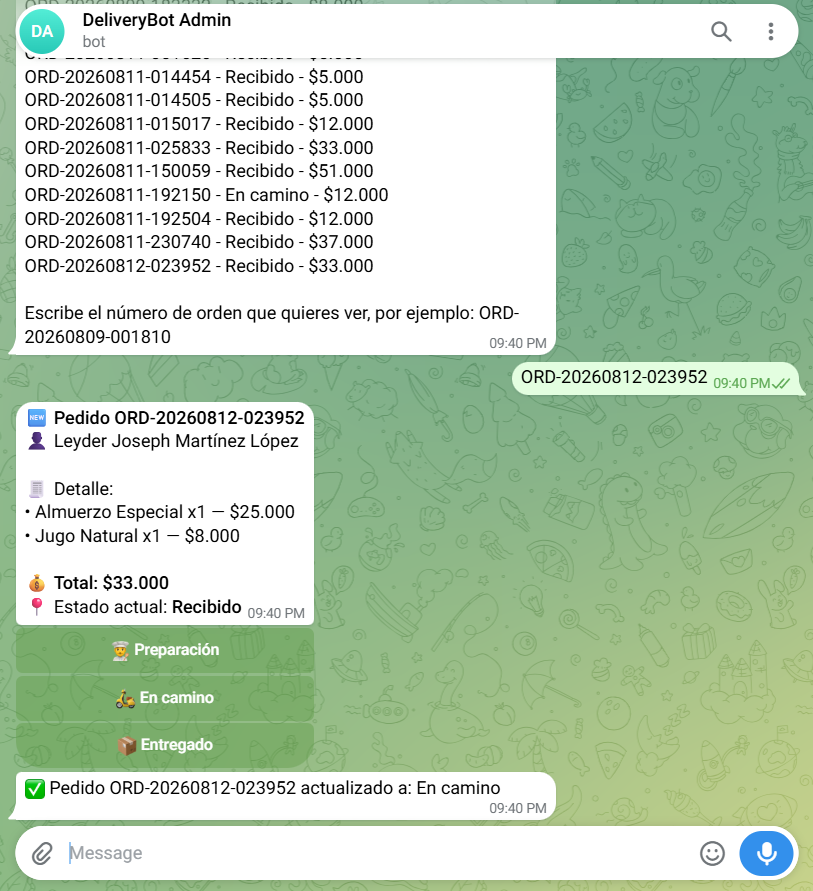

### 5. El cliente recibe cada actualización en tiempo real
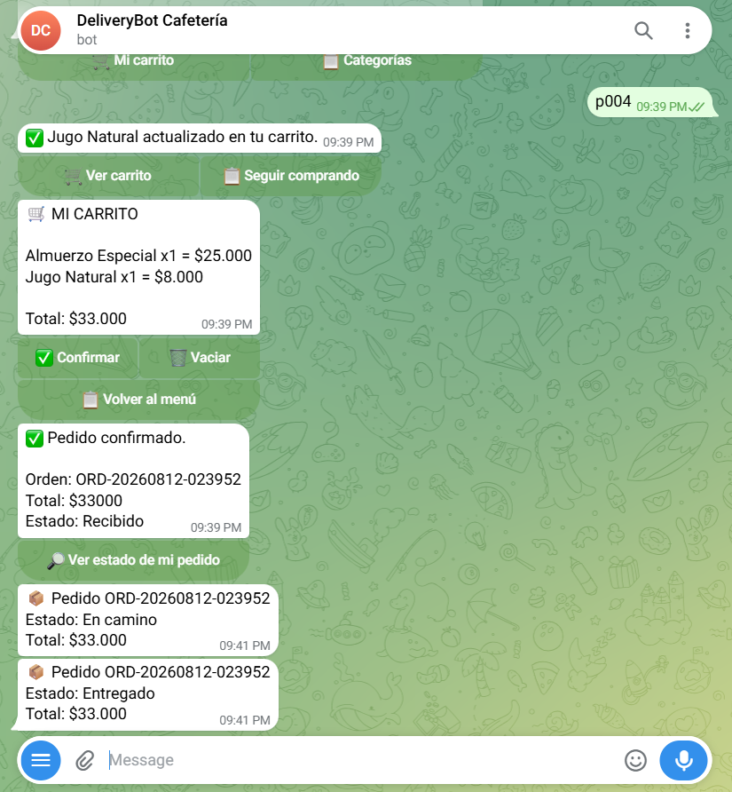

### 6. Ambos bots trabajan en paralelo, cada uno con su propio historial de chat
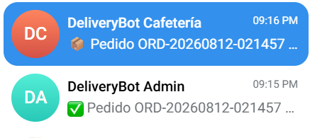

---

## 🚀 Puesta en marcha

1. **Crear los dos bots en Telegram** vía [@BotFather](https://t.me/BotFather): uno para clientes, otro para administración.
2. **Crear el spreadsheet** `DeliveryBot_DB` con las 5 hojas descritas arriba (MENU, PEDIDOS, USUARIOS, SESSIONS, ADMINS).
3. **En n8n**, crear las credenciales:
   - `Telegram account` (bot de clientes).
   - `DeliveryBot Telegram Admin` (bot de administración).
   - `DeliveryBot Google Sheets` (OAuth2).
4. **Importar los 4 workflows** (`DeliveryBot - Pedidos`, `DeliveryBot - Estados`, `DeliveryBot - Reporte Diario`, `DeliveryBot - Admin`) y asignar las credenciales correspondientes en cada nodo.
5. **Agregar al menos un administrador** en la hoja `ADMINS` (`telegram_id`, `nombre`, `activo = TRUE`).
6. **Publicar (Active)** los 4 workflows.
7. Probar de punta a punta: hacer un pedido desde el bot de clientes y verificar que la notificación, el cambio de estado y el reporte lleguen correctamente al bot de administración.

---

## 💬 Convenciones de comandos

**Bot de clientes:**
| Acción | Cómo se hace |
|---|---|
| Agregar un producto | Escribir su código, ej. `P001` |
| Quitar una unidad | Escribir el código con un guion, ej. `-P001` |
| Ver carrito / confirmar / vaciar | Botones del menú |
| Ver estado del pedido | Botón "🔎 Ver estado de mi pedido" tras confirmar, o desde el menú principal |

**Bot de administración:**
| Acción | Cómo se hace |
|---|---|
| Ver pedidos pendientes | Botón "📋 Pedidos pendientes" |
| Ver el detalle de un pedido | Escribir su `id_pedido`, ej. `ORD-20260812-023952` |
| Cambiar el estado | Botones "👨‍🍳 Preparación" / "🛵 En camino" / "📦 Entregado" |
| Reporte del día | Botón "📊 Reporte de hoy" |

---

## 🔐 Seguridad

- Los tokens de ambos bots y las credenciales de Google solo están guardados en el gestor de credenciales de n8n — nunca en los archivos `.json` de los workflows ni en este repositorio.
- El acceso al bot de administración es por lista blanca (hoja `ADMINS`); para revocar acceso basta con poner `activo = FALSE`.

---

---

## 🏆 Update: Examen — Sistema de Puntos de Lealtad

Se ha incorporado un sistema de acumulación y consulta de puntos de lealtad para recompensar la preferencia de los clientes[cite: 1].

### 🧠 Lógica de cálculo e implementación

1. **Cálculo de Puntos (Nodo Edit Fields / Set):**
   - En el flujo de confirmación del pedido (`DeliveryBot - Pedidos`), tras validar la existencia de stock, se calcula la bonificación equivalente a **1 punto por cada $5,000 gastados**[cite: 1].
   - **Expresión utilizada:**
     ```javascript
     Math.floor(Number($json.total_pago || 0) / 5000)
     ```

2. **Persistencia de Datos:**
   - Se consulta la hoja **`USUARIOS`** en Google Sheets filtrando por el `telegram_id` del comprador[cite: 1].
   - Mediante un nodo *Code*, se toma el acumulado actual (`puntos_lealtad`) y se le suman los nuevos puntos generados[cite: 1].
   - Se actualiza o inserta (upsert) la fila correspondiente utilizando el nodo de Google Sheets[cite: 1].

3. **Interfaz del Bot (Menú Principal):**
   - Se agregó el botón **`🏆 Ver mis Puntos`** en la botonera principal (`inline_keyboard`) del mensaje de bienvenida (`/start`) y en los atajos de teclado[cite: 1].

4. **Respuesta al Cliente:**
   - Al seleccionar la opción de puntos o escribir palabras clave relacionadas, el bot responde con la estructura[cite: 1]:
     > *Hola [Nombre], actualmente tienes 🏆 [Puntos] puntos acumulados. ¡Sigue comprando para canjear premios!*[cite: 1]

---

### 📸 Capturas de pantalla (Evidencias)

| Evidencia | Captura |
|---|---|
| **Nodos nuevos en el canvas de n8n** | 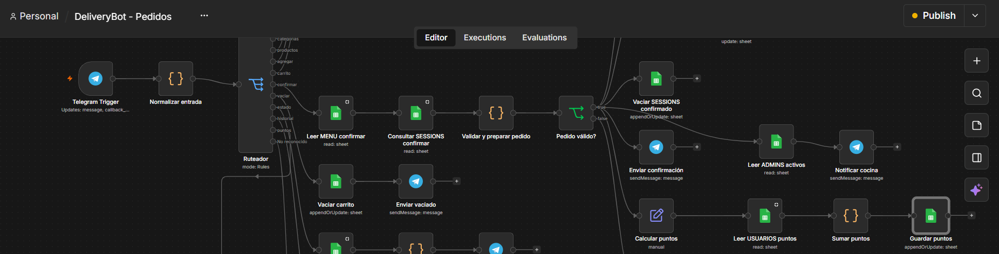 |
| **Prueba exitosa en Telegram** | 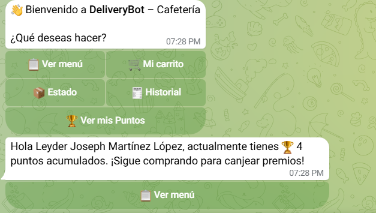 |
| **Evidencia en Google Sheets** | 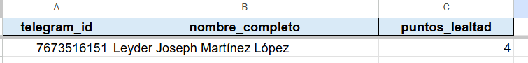 |


## 👤 Autor

Proyecto desarrollado por Leyder Martínez
